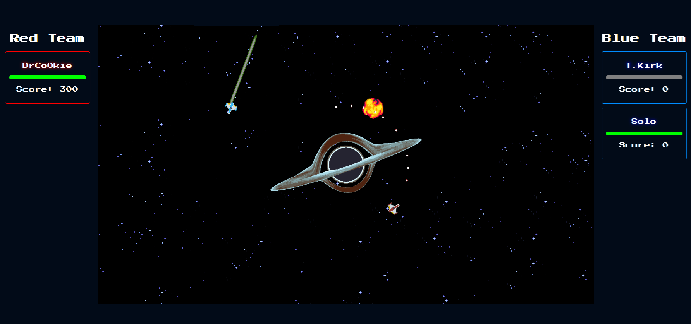

# Space Shooter

A real-time multiplayer space shooter game built with React and Node.js.




## Installation

1. Clone the repository:
    ```bash
    git clone https://github.com/web-classroom/7-react-libre-tuesday-spaceshooter
    ```

2. Navigate to the project directory and install dependencies:
    ```bash
    cd space-shooter
    npm install
    ```

3. Start the server:
    ```bash
    node server/index.js
    ```
    
4. Start the client:
    ```bash
    npm start
    ```

## Usage

1. Open the application in your web browser at `localhost:3000`
2. Enter your nickname and choose a team.
3. Start the game and enjoy!

## Technologies Used

- React
- Node.js
- Socket.io
- HTML5 Canvas

## Contributors

- [Timothée Van Hove](https://github.com/DrC0okie)


## Attributions

This project uses the following assets from various authors:

### Game Assets

1. **Red Ship, Blue Ship, Teleport laser beam, red and blue projectiles**
   - **Author**: Author Name
   - **Source**: [Space Shooter Redux](https://kenney.nl/assets/space-shooter-redux)
   - **License**: [CC0 1.0 UNIVERSAL](https://creativecommons.org/publicdomain/zero/1.0/)
  
2. **Canvas Blackhole**
   - **Author**: [Deep-Fold](https://deep-fold.itch.io/)
   - **Source**: [Pixel planet generator](https://deep-fold.itch.io/pixel-planet-generator)
   - **License**: [MIT](https://mit-license.org/)
  
3. **Explosion tileset**
   - **Author**: [MattWalkden](https://mattwalkden.itch.io/)
   - **Source**: [Free Lunar Battle Pack](https://mattwalkden.itch.io/lunar-battle-pack)
   - **License**: [CC0 1.0 UNIVERSAL](https://creativecommons.org/publicdomain/zero/1.0/)
  
4. **Homepage Background Image**
   - **Author**: Unknown
   - **Source**: [wallpapercave.com](https://wallpapercave.com)
   - **Link**: [Pixel space wallpaper](https://wallpapercave.com/w/wp7872665)
   - **License**: Unknown
  
5. **Home page soundtrack**
   - **Author**: [alkakrab](https://alkakrab.itch.io/)
   - **Source**: [Free Sci-Fi Game Music Pack by alkakrab (itch.io)](https://alkakrab.itch.io/free-sci-fi-game-music-pack)
   - **License**: none, except "Absolutely Free For Commercial use" from the author.

6. **Game page soundtrack**
   - **Author**: [Oblidivm](https://opengameart.org/users/oblidivm)
   - **Source**: [Space Shooter Music | OpenGameArt.org](https://opengameart.org/content/space-shooter-music)
   - **License**: [CC BY 3.0](https://creativecommons.org/licenses/by/3.0/)


Please refer to the respective links for the full terms and conditions of use.


## License

This project is licensed under the MIT License.
